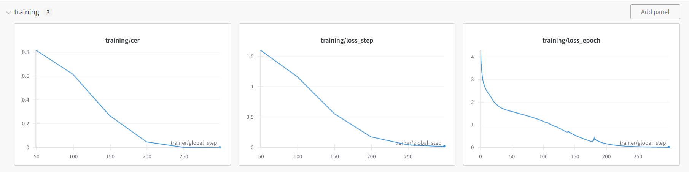
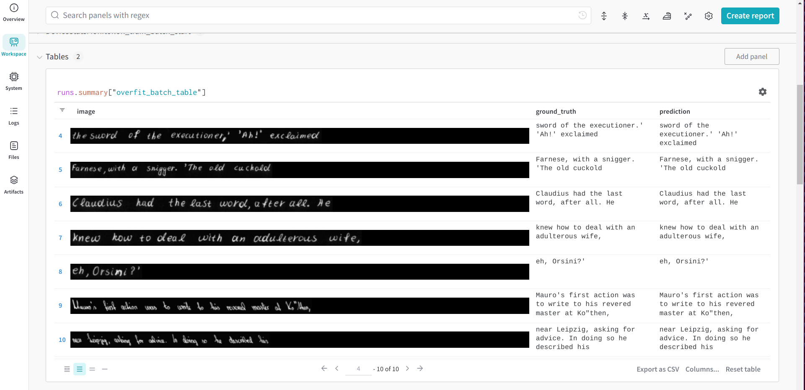

# Rewrite of the text-recogniser project of <a href="https://github.com/the-full-stack/fsdl-text-recognizer-2022-labs">fsdl</a>.
*Given image input with handwritten text, infer the text and output the associated string.*

This repo aims to reproduce the text-recogniser project from fsdl while adding a few improvements over model architecture as well as practical "hacks" to reduce the cost (**monetary** and **tech debt**) of the project.

The project itself is fairly comprehensive and offers a lot of learning:
* Distributed training with **PyTorch Lightning**
* Data wrangling and data synthesis using the <a href="https://fki.tic.heia-fr.ch/databases/iam-handwriting-database">IAM</a> and <a href="https://www.nist.gov/itl/products-and-services/emnist-dataset">EMNIST</a> datasets.
* Experiment tracking with **wandb**

## My improvements over the fsdl project:
* Removed a lot of argparse boilerplate in favour of `LightningCLI` and YAML config files.
* I use my own `ResNet`, giving me more customisability, in contrast to using a fixed `resnet18` architecture.
* Instead of 2D $\text{sin}$ and $\text{cos}$ positional embedding, my model learns the positional embeddings. This is similar to GPT-2 training.
* In the transformer decoder, I use `dropout=0` in line with GPT training, although it is easy to set it to other values from the CLI `--model.tf_dropout=DROPOUT`.
* In the fsdl repo they set the `ignore_index=self.padding_token` in the cross entropy loss, which seems to lead to worse performance, so I removed that.
* In fsdl, if the data are not available in the local file system, they are downloaded from `S3`. Hosting data on `S3` costs money, so I set up my google drive API and host my data on my personal google drive which is zero-cost.
	* Since this project is intended to be interacted with either via the Gradio app (if lambda still running) or as a POC, the google drive api is not publicly accessible and I configured authentication to let me interact with it.
	* The credentials for the google drive api should live in the root directory as `token.json` or if the token has expired, flow credentials in the same directory under the name of `google_drive_credentials.json` should exist.
	* The google drive download function is available in the <a href="./model_package/project_utils.py">project utils file</a>.


## Maintainer notes:
* If bumping the version of python support to 3.12 and above, I could swap the use of `boltons.cacheutils.cachedproperty` for `functools.cached_property`. Currently I'm aiming to support python 3.11, which still uses the old version of `functools.cached_property` which has <a href="https://discuss.python.org/t/finding-a-path-forward-for-functools-cached-property/23757">tricky locking</a> in multithreaded apps, so will use the `boltons` version for now.
* For parsing `xml`, I currently use <a href="https://pypi.org/project/defusedxml">defusedxml</a> since the standard lib can be vulnerable to some bad `xml`.

## Notes on IAM data:
* Some authours have written stuff like `Sentence Database P02-109` and then horizontal lines and then the content they were actually supposed to write. To deal with this, I only take the lines starting from the first line that appears in the machine-written part of the form and end in the first line, bottom to top, that appears in the form. The hope is to filter out invalid handwritten text that surrounds the desired content of the machine-written part.
	* Example of a bad form is: `p02-109`.
* A few authours of forms have written in all-caps undermining the case sensitive nature of the labels. When filtering lines based on the machine part of the xml, I will uppercase the validation string (machine part). The all-caps forms are:

	```python
	['g07-000a', 'g07-003a', 'f07-101a', 'g07-007a', 'g01-022']
	```
* I always work with grayscale colourmapping. Throughout the codebase there might be some misterious `'L'` arguments passed to `PIL` functions. This stands for *Luminance* according to <a href="https://stackoverflow.com/questions/52307290/what-is-the-difference-between-images-in-p-and-l-mode-in-pil">this</a> stack overflow post and only stores grayscale.
	* Also remember that PIL sizes return `(width, height)` layout in contrast to most array APIs.
### Notes on IAMLines data:
* Some tricky ids to test on:

	```python
	['h04-082', 'p02-155', 'j07-005', 'h06-089', 'a01-072x', 'p02-155', 'g03-004']
	```
* By following the fsdl recipe for getting line regions, I also found a few bad forms where the lines overlap too much resulting in the image being of 2 lines but the label is still the text of the first line only; forcing the algorithm to somehow ignore the second line of text from the image. To deal with this, I limited the `y2` coord to the `min` of  `y1 + metadata.MAX_LINE_HEIGHT` and `el.attrib['y'] + el.attrib['height']`.
	* Empirically, this gave max height line of `119` pixels. This is even though `metadata.MAX_LINE_HEIGHT=60`. This is because the line height increases not only due to increase in `y2` (which we address with this heuristic) but also due to decreases in `y1` (which we don't control). Nevertheless, I did some checks and didn't find instances of two lines in an image anymore.
	* Example of this behaviour is line at index 8 in form `r02-060`. The "f"'s overlap so line stop carries to the next line.
* I save the line crops as resized to height of `28` similar to the NIST data.
	```python
	h = crop.size[-1]
	crop = crop.resize(
		(
			int(d / (h / 28)) for d in crop.size
		),
		resample=Image.BILINEAR
	)
	```
### Notes on IAMParagraphs data:
* The paragraph crop results from taking a crop from the first line region to the last line region in  the `line_regions_by_id` attribute.
* Similarly to the IAMLines data, I resize the paragraph crops so I have 28 pixels of height per line:

	```python
	def resize_to_pix_per_line(img, num_lines, pix=28):
		h = img.size[-1]
		scale_factor = h / (pix * num_lines)
		return img.resize(
			(int(d / scale_factor) for d in img.size),
			resample=Image.BILINEAR
		)
	```

## Progress:
* I tested my lit transformer manually to overfit a single batch of `EMNISTLines` and reach zero Character Error Rate (CER) on it. It worked after 200 gradient steps.
* I also tested the lit transformer to overfit a single batch of the more challenging `IAMLines`, and reach zero CER. This worked in about 300 epochs.

	* Below is a `wandb` dashboard of training metrics for the overfit batch.

	

	* Below is a `wandb` table of logged images from batch along with ground truth label and predictions.

	

	* The command to reproduce the results is:

	```bash
	$ python training/run_experiment.py fit --config iam_lines_experiment_config.yaml --data=IAMLines --trainer.overfit_batches=1 --trainer.max_epochs=300 --trainer.check_val_every_n_epoch=50 --data.batch_size=64 --my_model_checkpoint.every_n_epochs=20
	```

* The `overfit_batches=1` using the lightning `Trainer` seems to use a different validation batch than the training batch so I wrote a custom lightning `Callback` to log stuff about the training batch.
* Managed to enforce equal arg vals for `data.output_dims[0]` and `model.max_seq_length`, `data.input_dims` and `model.input_dims`, and `data.idx_to_char` and `model.idx_to_char` via `link_arguments` of `jsonargparse` after subclassing the `LightningCLI` (equality enforced upon data instantiation). Upon instantiation of `data`, the data attributes are set and then used as input to the constructor of the model.
* Made the `ModelCheckpoint` callback configurable in the `training/run_experiment.py` script via the `my_model_checkpoint` name in the cli (by subclassing the `LightningCLI`).
* Made it easy to select which dataset to train on via `LightningCLI`. The usage is e.g.,

	```bash
	$ python training/run_experiment.py fit --config CONFIG --data=IAMLines ...
	```
* Also tested `IAMParagraphs` and it works.

## Running experiments:
* First `cd` in the root of the repo (parent of `model_package`).
* Second, run `export PYTHONPATH=.` - to add the current directory to `sys.path`.
* Third, run `wandb login` to login to the wandb with your api key.
* Fourth, run `export WANDB_START_METHOD="thread"` otherwise some weird threading exception occurs. For more info see this <a href="https://github.com/wandb/wandb/issues/3223#issuecomment-1032820724">issue</a>.
* Then run what you wanna run:

	```bash
	$ python training/run_experiment.py fit --config emnistlines_experiment_config.yaml --data=EMNISTLines --trainer.overfit_batches=1 --trainer.max_epochs=200 --trainer.check_val_every_n_epoch=50 --data.batch_size=64
	```
* To e.g., continue the training for another 200 epochs, just set the `--trainer.max_epochs=400` and provide a `--ckpt_path` path to the model that has trained for 200 epochs like so:

	```bash
	$ python training/run_experiment.py fit --config emnistlines_experiment_config.yaml --data=EMNISTLines --trainer.overfit_batches=1 --trainer.max_epochs=400 --trainer.check_val_every_n_epoch=50 --data.batch_size=64 --ckpt_path='PathToCkpt'
	```
* To run the `test` subcommand, do:

	```bash
	$ python training/run_experiment.py test --config emnistlines_experiment_config.yaml --data=EMNISTLines --data.batch_size=64 --ckpt_path='PathToCkpt'
	```

> **NOTE**: Since in overfit batches mode the validation batch is not guaranteed to be the same as the training batch, I wrote a callback to log images and predictions for the training batch that we actually overfit. To check which epoch the table comes from, check the `.json` file of the table from the wandb UI in the `files/medai/table` section of the run.

## Quick sanity check runs:

```bash
$ python training/run_experiment.py fit --config iam_lines_experiment_config.yaml --data=IAMLines --trainer.limit_train_batches=5 --trainer.limit_val_batches=1 --trainer.max_epochs=20 --trainer.check_val_every_n_epoch=5 --data.batch_size=64 --my_model_checkpoint.every_n_epochs=4 --data.num_workers=4 --trainer.strategy=ddp
```

## Google Drive API setup (for hosting data):
* Follow instructions <a href="https://developers.google.com/drive/api/quickstart/python">here</a>.
* You download the object as `io.BytesIO` and then call the `getvalue()` on it and save it as binary file with `open(file_path, 'wb')`.
* You download a file from google drive based on the file id which can be found by copying the sharable link of the file in the google drive gui and the long, weird sequence of chars in the link is the file id.
* The relevant google drive id and the name of the file after being saved must be made available e.g., in `root/data/raw/iam/metadata.toml`.
